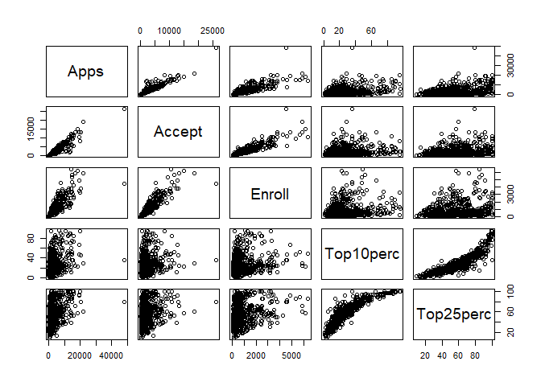
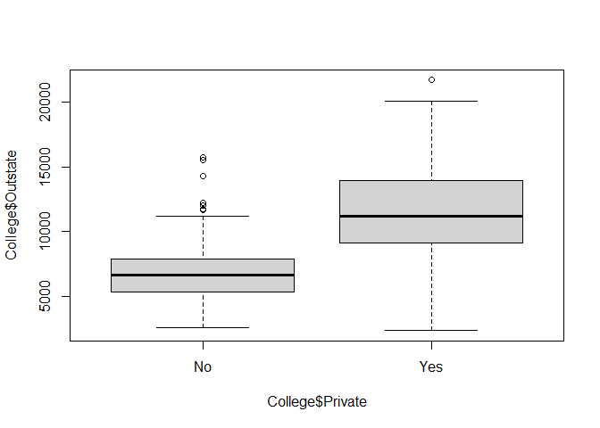
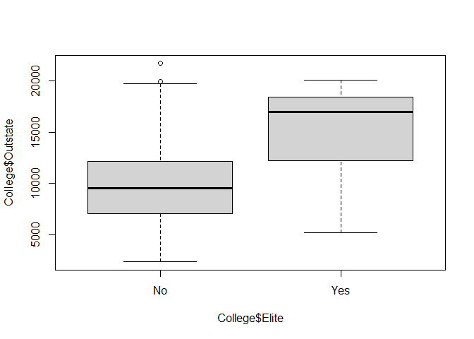
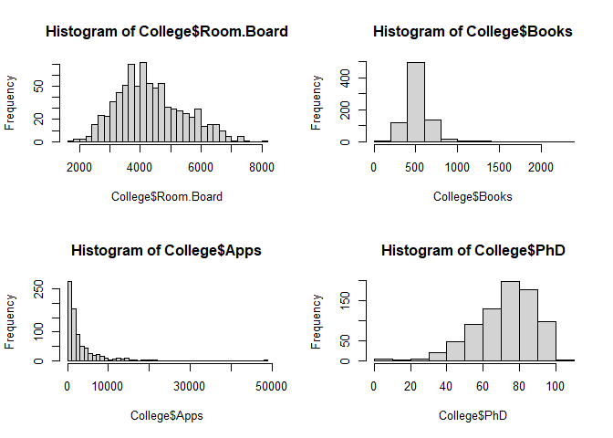

ISLR ML Problems
================
Robbie Mc Guinness
12/11/2021

# Chapter 2: Statistical Learning

8.  

``` r
library(ISLR)
summary(College)
```

    ##  Private        Apps           Accept          Enroll       Top10perc    
    ##  No :212   Min.   :   81   Min.   :   72   Min.   :  35   Min.   : 1.00  
    ##  Yes:565   1st Qu.:  776   1st Qu.:  604   1st Qu.: 242   1st Qu.:15.00  
    ##            Median : 1558   Median : 1110   Median : 434   Median :23.00  
    ##            Mean   : 3002   Mean   : 2019   Mean   : 780   Mean   :27.56  
    ##            3rd Qu.: 3624   3rd Qu.: 2424   3rd Qu.: 902   3rd Qu.:35.00  
    ##            Max.   :48094   Max.   :26330   Max.   :6392   Max.   :96.00  
    ##    Top25perc      F.Undergrad     P.Undergrad         Outstate    
    ##  Min.   :  9.0   Min.   :  139   Min.   :    1.0   Min.   : 2340  
    ##  1st Qu.: 41.0   1st Qu.:  992   1st Qu.:   95.0   1st Qu.: 7320  
    ##  Median : 54.0   Median : 1707   Median :  353.0   Median : 9990  
    ##  Mean   : 55.8   Mean   : 3700   Mean   :  855.3   Mean   :10441  
    ##  3rd Qu.: 69.0   3rd Qu.: 4005   3rd Qu.:  967.0   3rd Qu.:12925  
    ##  Max.   :100.0   Max.   :31643   Max.   :21836.0   Max.   :21700  
    ##    Room.Board       Books           Personal         PhD        
    ##  Min.   :1780   Min.   :  96.0   Min.   : 250   Min.   :  8.00  
    ##  1st Qu.:3597   1st Qu.: 470.0   1st Qu.: 850   1st Qu.: 62.00  
    ##  Median :4200   Median : 500.0   Median :1200   Median : 75.00  
    ##  Mean   :4358   Mean   : 549.4   Mean   :1341   Mean   : 72.66  
    ##  3rd Qu.:5050   3rd Qu.: 600.0   3rd Qu.:1700   3rd Qu.: 85.00  
    ##  Max.   :8124   Max.   :2340.0   Max.   :6800   Max.   :103.00  
    ##     Terminal       S.F.Ratio      perc.alumni        Expend     
    ##  Min.   : 24.0   Min.   : 2.50   Min.   : 0.00   Min.   : 3186  
    ##  1st Qu.: 71.0   1st Qu.:11.50   1st Qu.:13.00   1st Qu.: 6751  
    ##  Median : 82.0   Median :13.60   Median :21.00   Median : 8377  
    ##  Mean   : 79.7   Mean   :14.09   Mean   :22.74   Mean   : 9660  
    ##  3rd Qu.: 92.0   3rd Qu.:16.50   3rd Qu.:31.00   3rd Qu.:10830  
    ##  Max.   :100.0   Max.   :39.80   Max.   :64.00   Max.   :56233  
    ##    Grad.Rate     
    ##  Min.   : 10.00  
    ##  1st Qu.: 53.00  
    ##  Median : 65.00  
    ##  Mean   : 65.46  
    ##  3rd Qu.: 78.00  
    ##  Max.   :118.00

``` r
pairs(College[,2:6])
```

<!-- -->

``` r
boxplot(College$Outstate~College$Private)
```

<!-- -->

``` r
Elite<-rep("No",nrow(College))
Elite[College$Top10perc>50]<-"Yes"
Elite<-as.factor(Elite)
College<-data.frame(College,Elite)
summary(College$Elite)
```

    ##  No Yes 
    ## 699  78

``` r
boxplot(College$Outstate~College$Elite)
```

<!-- -->

``` r
par(mfrow=c(2,2))
hist(College$Room.Board,breaks=25)
hist(College$Books,breaks=15)
hist(College$Apps,breaks=50)
hist(College$PhD,breaks=12)
```

<!-- -->

9.  The variables Name and Origin are qualitative and the rest are
    quantitative.

``` r
for (i in 1:7)
{cat("The range of", names(Auto)[i],"is",range(Auto[,i]),"\n")}
```

    ## The range of mpg is 9 46.6 
    ## The range of cylinders is 3 8 
    ## The range of displacement is 68 455 
    ## The range of horsepower is 46 230 
    ## The range of weight is 1613 5140 
    ## The range of acceleration is 8 24.8 
    ## The range of year is 70 82

``` r
for (i in 1:7)
{cat("The mean and standard deviation of",names(Auto)[i],"are",mean(Auto[,i]),"and",sd(Auto[,i]),"\n")}
```

    ## The mean and standard deviation of mpg are 23.44592 and 7.805007 
    ## The mean and standard deviation of cylinders are 5.471939 and 1.705783 
    ## The mean and standard deviation of displacement are 194.412 and 104.644 
    ## The mean and standard deviation of horsepower are 104.4694 and 38.49116 
    ## The mean and standard deviation of weight are 2977.584 and 849.4026 
    ## The mean and standard deviation of acceleration are 15.54133 and 2.758864 
    ## The mean and standard deviation of year are 75.97959 and 3.683737

10. A. The first problem

B. Second problem

C. third problem

D. The first problem

E. Second problem

F. third problem

G. Second problem

H. third problem

# Chapter 3: Linear Regression

# Chapter 4: Classification

# Chapter 5: Resampling Methods

# Chapter 6: Linear Model Selection and Regularisation

# Chapter 7: Moving Beyond Linearity

# Chapter 8: Tree Based Methods

# Chapter 9: Support Vector Machines

# Chapter 10: Deep Learning

# Chapter 11: Survival Analysis and Censored Data

# Chapter 12: Unsupervised Learning

# Chapter 13: Multiple Testing

## R Markdown

This is an R Markdown document. Markdown is a simple formatting syntax
for authoring HTML, PDF, and MS Word documents. For more details on
using R Markdown see <http://rmarkdown.rstudio.com>.

When you click the **Knit** button a document will be generated that
includes both content as well as the output of any embedded R code
chunks within the document. You can embed an R code chunk like this:

``` r
summary(cars)
```

    ##      speed           dist       
    ##  Min.   : 4.0   Min.   :  2.00  
    ##  1st Qu.:12.0   1st Qu.: 26.00  
    ##  Median :15.0   Median : 36.00  
    ##  Mean   :15.4   Mean   : 42.98  
    ##  3rd Qu.:19.0   3rd Qu.: 56.00  
    ##  Max.   :25.0   Max.   :120.00

## Including Plots

You can also embed plots, for example:

<!-- -->

Note that the `echo = FALSE` parameter was added to the code chunk to
prevent printing of the R code that generated the plot.
