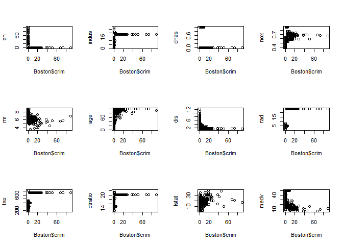

ISLR ML Problems
================
Robbie Mc Guinness
12/11/2021

# Chapter 2: Statistical Learning

### Question 8

``` r
library(ISLR)
summary(College)
```

    ##  Private        Apps           Accept          Enroll       Top10perc    
    ##  No :212   Min.   :   81   Min.   :   72   Min.   :  35   Min.   : 1.00  
    ##  Yes:565   1st Qu.:  776   1st Qu.:  604   1st Qu.: 242   1st Qu.:15.00  
    ##            Median : 1558   Median : 1110   Median : 434   Median :23.00  
    ##            Mean   : 3002   Mean   : 2019   Mean   : 780   Mean   :27.56  
    ##            3rd Qu.: 3624   3rd Qu.: 2424   3rd Qu.: 902   3rd Qu.:35.00  
    ##            Max.   :48094   Max.   :26330   Max.   :6392   Max.   :96.00  
    ##    Top25perc      F.Undergrad     P.Undergrad         Outstate    
    ##  Min.   :  9.0   Min.   :  139   Min.   :    1.0   Min.   : 2340  
    ##  1st Qu.: 41.0   1st Qu.:  992   1st Qu.:   95.0   1st Qu.: 7320  
    ##  Median : 54.0   Median : 1707   Median :  353.0   Median : 9990  
    ##  Mean   : 55.8   Mean   : 3700   Mean   :  855.3   Mean   :10441  
    ##  3rd Qu.: 69.0   3rd Qu.: 4005   3rd Qu.:  967.0   3rd Qu.:12925  
    ##  Max.   :100.0   Max.   :31643   Max.   :21836.0   Max.   :21700  
    ##    Room.Board       Books           Personal         PhD        
    ##  Min.   :1780   Min.   :  96.0   Min.   : 250   Min.   :  8.00  
    ##  1st Qu.:3597   1st Qu.: 470.0   1st Qu.: 850   1st Qu.: 62.00  
    ##  Median :4200   Median : 500.0   Median :1200   Median : 75.00  
    ##  Mean   :4358   Mean   : 549.4   Mean   :1341   Mean   : 72.66  
    ##  3rd Qu.:5050   3rd Qu.: 600.0   3rd Qu.:1700   3rd Qu.: 85.00  
    ##  Max.   :8124   Max.   :2340.0   Max.   :6800   Max.   :103.00  
    ##     Terminal       S.F.Ratio      perc.alumni        Expend     
    ##  Min.   : 24.0   Min.   : 2.50   Min.   : 0.00   Min.   : 3186  
    ##  1st Qu.: 71.0   1st Qu.:11.50   1st Qu.:13.00   1st Qu.: 6751  
    ##  Median : 82.0   Median :13.60   Median :21.00   Median : 8377  
    ##  Mean   : 79.7   Mean   :14.09   Mean   :22.74   Mean   : 9660  
    ##  3rd Qu.: 92.0   3rd Qu.:16.50   3rd Qu.:31.00   3rd Qu.:10830  
    ##  Max.   :100.0   Max.   :39.80   Max.   :64.00   Max.   :56233  
    ##    Grad.Rate     
    ##  Min.   : 10.00  
    ##  1st Qu.: 53.00  
    ##  Median : 65.00  
    ##  Mean   : 65.46  
    ##  3rd Qu.: 78.00  
    ##  Max.   :118.00

``` r
pairs(College[,2:6])
```

<!-- -->

``` r
boxplot(College$Outstate~College$Private)
```

<!-- -->

``` r
Elite<-rep("No",nrow(College))
Elite[College$Top10perc>50]<-"Yes"
Elite<-as.factor(Elite)
College<-data.frame(College,Elite)
summary(College$Elite)
```

    ##  No Yes 
    ## 699  78

``` r
boxplot(College$Outstate~College$Elite)
```

<!-- -->

``` r
par(mfrow=c(2,2))
hist(College$Room.Board,breaks=25)
hist(College$Books,breaks=15)
hist(College$Apps,breaks=50)
hist(College$PhD,breaks=12)
```

<!-- -->

### Question 9

The variables Name and Origin are qualitative and the rest are
quantitative.

``` r
for (i in 1:7)
{cat("The range of", names(Auto)[i],"is",range(Auto[,i]),"\n")}
```

    ## The range of mpg is 9 46.6 
    ## The range of cylinders is 3 8 
    ## The range of displacement is 68 455 
    ## The range of horsepower is 46 230 
    ## The range of weight is 1613 5140 
    ## The range of acceleration is 8 24.8 
    ## The range of year is 70 82

``` r
for (i in 1:7)
{cat("The mean and standard deviation of",names(Auto)[i],"are",mean(Auto[,i]),"and",sd(Auto[,i]),"\n")}
```

    ## The mean and standard deviation of mpg are 23.44592 and 7.805007 
    ## The mean and standard deviation of cylinders are 5.471939 and 1.705783 
    ## The mean and standard deviation of displacement are 194.412 and 104.644 
    ## The mean and standard deviation of horsepower are 104.4694 and 38.49116 
    ## The mean and standard deviation of weight are 2977.584 and 849.4026 
    ## The mean and standard deviation of acceleration are 15.54133 and 2.758864 
    ## The mean and standard deviation of year are 75.97959 and 3.683737

``` r
Auto2<-Auto[-c(10:85),]
for (i in 1:7)
{cat("Having removed the 10th through 85th rows; the range of", names(Auto2)[i],"is",range(Auto2[,i]),"\n and the mean and standard deviation of",names(Auto2)[i],"are",mean(Auto2[,i]),"and",sd(Auto2[,i]),".\n")}
```

    ## Having removed the 10th through 85th rows; the range of mpg is 11 46.6 
    ##  and the mean and standard deviation of mpg are 24.40443 and 7.867283 .
    ## Having removed the 10th through 85th rows; the range of cylinders is 3 8 
    ##  and the mean and standard deviation of cylinders are 5.373418 and 1.654179 .
    ## Having removed the 10th through 85th rows; the range of displacement is 68 455 
    ##  and the mean and standard deviation of displacement are 187.2405 and 99.67837 .
    ## Having removed the 10th through 85th rows; the range of horsepower is 46 230 
    ##  and the mean and standard deviation of horsepower are 100.7215 and 35.70885 .
    ## Having removed the 10th through 85th rows; the range of weight is 1649 4997 
    ##  and the mean and standard deviation of weight are 2935.972 and 811.3002 .
    ## Having removed the 10th through 85th rows; the range of acceleration is 8.5 24.8 
    ##  and the mean and standard deviation of acceleration are 15.7269 and 2.693721 .
    ## Having removed the 10th through 85th rows; the range of year is 70 82 
    ##  and the mean and standard deviation of year are 77.14557 and 3.106217 .

``` r
pairs(Auto[,1:7])
```

<!-- -->

There appears to be strong positive linear relationships between
horsepower and weight. Similarly, there is a positive approximately
linear relationship between horsepower and displacement and between
weight and displacement.

The predictors displacement, weight and horsepower seem to be the ones
with the most obvious relationship to mpg. Each exhibits a decreasing
weakly non-linear relationship with mpg.

### Question 10

``` r
library(ISLR2)
```

    ## 
    ## Attaching package: 'ISLR2'

    ## The following object is masked _by_ '.GlobalEnv':
    ## 
    ##     College

    ## The following objects are masked from 'package:ISLR':
    ## 
    ##     Auto, Credit

``` r
cat("The number of rows in the Boston dataset is",nrow(Boston),".")
```

    ## The number of rows in the Boston dataset is 506 .

``` r
cat("The number of columns in the Boston dataset is",ncol(Boston),".")
```

    ## The number of columns in the Boston dataset is 13 .

The rows represent different suburbs of Boston and the columns represent
various housing and area statistics for each suburb.

``` r
pairs(Boston[,1:6])
```

<!-- -->

``` r
pairs(Boston[,7:13])
```

<!-- -->

``` r
par(mfrow=c(3,4))
for (i in 2:13)
{plot(Boston$crim,Boston[,i],ylab=names(Boston)[i])}
```

<!-- -->

None of the predictors seem to have a correlation with the per capita
crime rate

``` r
par(mfrow=c(3,1))
hist(Boston$crim,breaks=30)
hist(Boston$tax,breaks=30)
hist(Boston$ptratio,breaks=30)
```

<!-- -->

From the histograms it is clear to see that there is a small number of
outliers that have very large crime rates. Similarly, there are a number
of suburbs where property tax is appreacibly above all other suburbs.
The pupil teacher ratio is reasonably uniform apart from one large peak
just above 20.

``` r
cat("The number of suburbs bordering the Charles river is",sum(Boston$chas),"\n")
```

    ## The number of suburbs bordering the Charles river is 35

``` r
cat("The median pupil teacher ratio is",median(Boston$ptratio))
```

    ## The median pupil teacher ratio is 19.05

``` r
cat("The minimum median value of owner occupied homes is",min(Boston$medv),"and it occurs in the",which.min(Boston$medv),"suburb.\n")
```

    ## The minimum median value of owner occupied homes is 5 and it occurs in the 399 suburb.

``` r
medians<-rep(0,ncol(Boston))
for (i in 1:ncol(Boston))
{if (median(Boston[,i])==0)
     {medians[i]=mean(Boston[,i])}
else
{medians[i]=median(Boston[,i])}
cat("The",names(Boston)[i], "predictor value at this location is",round(Boston[which.min(Boston$medv),i]/medians[i],3),"times the median value of that predictor. \n")}
```

    ## The crim predictor value at this location is 149.514 times the median value of that predictor. 
    ## The zn predictor value at this location is 0 times the median value of that predictor. 
    ## The indus predictor value at this location is 1.868 times the median value of that predictor. 
    ## The chas predictor value at this location is 0 times the median value of that predictor. 
    ## The nox predictor value at this location is 1.288 times the median value of that predictor. 
    ## The rm predictor value at this location is 0.878 times the median value of that predictor. 
    ## The age predictor value at this location is 1.29 times the median value of that predictor. 
    ## The dis predictor value at this location is 0.464 times the median value of that predictor. 
    ## The rad predictor value at this location is 4.8 times the median value of that predictor. 
    ## The tax predictor value at this location is 2.018 times the median value of that predictor. 
    ## The ptratio predictor value at this location is 1.06 times the median value of that predictor. 
    ## The lstat predictor value at this location is 2.693 times the median value of that predictor. 
    ## The medv predictor value at this location is 0.236 times the median value of that predictor.

``` r
room7<-rep(0,nrow(Boston))
room7[Boston$rm>7]=1
cat("The number of suburbs that average more than 7 rooms per house is",sum(room7)," representing",round(sum(room7)/length(room7),3),"of suburbs  \n")
```

    ## The number of suburbs that average more than 7 rooms per house is 64  representing 0.126 of suburbs

``` r
room8<-rep(0,nrow(Boston))
room8[Boston$rm>8]=1
cat("The number of suburbs that average more than 8 rooms per house is",sum(room8)," representing",round(sum(room8)/length(room8),3),"of suburbs  \n")
```

    ## The number of suburbs that average more than 8 rooms per house is 13  representing 0.026 of suburbs

# Chapter 3: Linear Regression

## Question 8

``` r
Auto.fit1<-lm(mpg~horsepower,data=Auto)
summary(Auto.fit1)
```

    ## 
    ## Call:
    ## lm(formula = mpg ~ horsepower, data = Auto)
    ## 
    ## Residuals:
    ##      Min       1Q   Median       3Q      Max 
    ## -13.5710  -3.2592  -0.3435   2.7630  16.9240 
    ## 
    ## Coefficients:
    ##              Estimate Std. Error t value Pr(>|t|)    
    ## (Intercept) 39.935861   0.717499   55.66   <2e-16 ***
    ## horsepower  -0.157845   0.006446  -24.49   <2e-16 ***
    ## ---
    ## Signif. codes:  0 '***' 0.001 '**' 0.01 '*' 0.05 '.' 0.1 ' ' 1
    ## 
    ## Residual standard error: 4.906 on 390 degrees of freedom
    ## Multiple R-squared:  0.6059, Adjusted R-squared:  0.6049 
    ## F-statistic: 599.7 on 1 and 390 DF,  p-value: < 2.2e-16

``` r
predict(Auto.fit1,data.frame(horsepower=(98)),interval="confidence")
```

    ##        fit      lwr      upr
    ## 1 24.46708 23.97308 24.96108

``` r
predict(Auto.fit1,data.frame(horsepower=(98)),interval="prediction")
```

    ##        fit     lwr      upr
    ## 1 24.46708 14.8094 34.12476

There is a negative relationship between mpg and horsepower. For each
unit increase in horsepower the mpg decreases by `coef(Auto.fit1)[2]`.
The confidence and prediction intervals for a horsepower of 98 are as
given above.

``` r
plot(Auto$horsepower,Auto$mpg)
abline(Auto.fit1)
```

<!-- -->

``` r
par(mfrow=c(2,2))
plot(Auto.fit1)
```

<!-- -->

\#\#Question 9

``` r
cor(Auto[,1:8])
```

    ##                     mpg  cylinders displacement horsepower     weight
    ## mpg           1.0000000 -0.7776175   -0.8051269 -0.7784268 -0.8322442
    ## cylinders    -0.7776175  1.0000000    0.9508233  0.8429834  0.8975273
    ## displacement -0.8051269  0.9508233    1.0000000  0.8972570  0.9329944
    ## horsepower   -0.7784268  0.8429834    0.8972570  1.0000000  0.8645377
    ## weight       -0.8322442  0.8975273    0.9329944  0.8645377  1.0000000
    ## acceleration  0.4233285 -0.5046834   -0.5438005 -0.6891955 -0.4168392
    ## year          0.5805410 -0.3456474   -0.3698552 -0.4163615 -0.3091199
    ## origin        0.5652088 -0.5689316   -0.6145351 -0.4551715 -0.5850054
    ##              acceleration       year     origin
    ## mpg             0.4233285  0.5805410  0.5652088
    ## cylinders      -0.5046834 -0.3456474 -0.5689316
    ## displacement   -0.5438005 -0.3698552 -0.6145351
    ## horsepower     -0.6891955 -0.4163615 -0.4551715
    ## weight         -0.4168392 -0.3091199 -0.5850054
    ## acceleration    1.0000000  0.2903161  0.2127458
    ## year            0.2903161  1.0000000  0.1815277
    ## origin          0.2127458  0.1815277  1.0000000

``` r
Auto.fit2<-lm(mpg~.-name,data=Auto)
summary(Auto.fit2)
```

    ## 
    ## Call:
    ## lm(formula = mpg ~ . - name, data = Auto)
    ## 
    ## Residuals:
    ##     Min      1Q  Median      3Q     Max 
    ## -9.5903 -2.1565 -0.1169  1.8690 13.0604 
    ## 
    ## Coefficients:
    ##                Estimate Std. Error t value Pr(>|t|)    
    ## (Intercept)  -17.218435   4.644294  -3.707  0.00024 ***
    ## cylinders     -0.493376   0.323282  -1.526  0.12780    
    ## displacement   0.019896   0.007515   2.647  0.00844 ** 
    ## horsepower    -0.016951   0.013787  -1.230  0.21963    
    ## weight        -0.006474   0.000652  -9.929  < 2e-16 ***
    ## acceleration   0.080576   0.098845   0.815  0.41548    
    ## year           0.750773   0.050973  14.729  < 2e-16 ***
    ## origin         1.426141   0.278136   5.127 4.67e-07 ***
    ## ---
    ## Signif. codes:  0 '***' 0.001 '**' 0.01 '*' 0.05 '.' 0.1 ' ' 1
    ## 
    ## Residual standard error: 3.328 on 384 degrees of freedom
    ## Multiple R-squared:  0.8215, Adjusted R-squared:  0.8182 
    ## F-statistic: 252.4 on 7 and 384 DF,  p-value: < 2.2e-16

``` r
par(mfrow=c(2,2))
plot(Auto.fit2)
```

<!-- -->

``` r
Auto.fit3<-lm(mpg~year+origin+year:origin,data=Auto)
summary(Auto.fit3)
```

    ## 
    ## Call:
    ## lm(formula = mpg ~ year + origin + year:origin, data = Auto)
    ## 
    ## Residuals:
    ##      Min       1Q   Median       3Q      Max 
    ## -11.3141  -3.7120  -0.6513   3.3621  15.5859 
    ## 
    ## Coefficients:
    ##             Estimate Std. Error t value Pr(>|t|)    
    ## (Intercept) -83.3809    12.0000  -6.948 1.57e-11 ***
    ## year          1.3089     0.1576   8.305 1.68e-15 ***
    ## origin       17.3752     6.8325   2.543   0.0114 *  
    ## year:origin  -0.1663     0.0889  -1.871   0.0621 .  
    ## ---
    ## Signif. codes:  0 '***' 0.001 '**' 0.01 '*' 0.05 '.' 0.1 ' ' 1
    ## 
    ## Residual standard error: 5.199 on 388 degrees of freedom
    ## Multiple R-squared:  0.5596, Adjusted R-squared:  0.5562 
    ## F-statistic: 164.4 on 3 and 388 DF,  p-value: < 2.2e-16

``` r
Auto.fit4<-lm(mpg~year*weight,data=Auto)
summary(Auto.fit4)
```

    ## 
    ## Call:
    ## lm(formula = mpg ~ year * weight, data = Auto)
    ## 
    ## Residuals:
    ##     Min      1Q  Median      3Q     Max 
    ## -8.0397 -1.9956 -0.0983  1.6525 12.9896 
    ## 
    ## Coefficients:
    ##               Estimate Std. Error t value Pr(>|t|)    
    ## (Intercept) -1.105e+02  1.295e+01  -8.531 3.30e-16 ***
    ## year         2.040e+00  1.718e-01  11.876  < 2e-16 ***
    ## weight       2.755e-02  4.413e-03   6.242 1.14e-09 ***
    ## year:weight -4.579e-04  5.907e-05  -7.752 8.02e-14 ***
    ## ---
    ## Signif. codes:  0 '***' 0.001 '**' 0.01 '*' 0.05 '.' 0.1 ' ' 1
    ## 
    ## Residual standard error: 3.193 on 388 degrees of freedom
    ## Multiple R-squared:  0.8339, Adjusted R-squared:  0.8326 
    ## F-statistic: 649.3 on 3 and 388 DF,  p-value: < 2.2e-16

``` r
Auto.fit5<-lm(mpg~log(weight),data=Auto)
summary(Auto.fit5)
```

    ## 
    ## Call:
    ## lm(formula = mpg ~ log(weight), data = Auto)
    ## 
    ## Residuals:
    ##      Min       1Q   Median       3Q      Max 
    ## -12.4315  -2.6752  -0.2888   1.9429  16.0136 
    ## 
    ## Coefficients:
    ##             Estimate Std. Error t value Pr(>|t|)    
    ## (Intercept) 209.9433     6.0002   34.99   <2e-16 ***
    ## log(weight) -23.4317     0.7534  -31.10   <2e-16 ***
    ## ---
    ## Signif. codes:  0 '***' 0.001 '**' 0.01 '*' 0.05 '.' 0.1 ' ' 1
    ## 
    ## Residual standard error: 4.189 on 390 degrees of freedom
    ## Multiple R-squared:  0.7127, Adjusted R-squared:  0.7119 
    ## F-statistic: 967.3 on 1 and 390 DF,  p-value: < 2.2e-16

``` r
Auto.fit6<-lm(mpg~poly(weight,3),data=Auto)
summary(Auto.fit6)
```

    ## 
    ## Call:
    ## lm(formula = mpg ~ poly(weight, 3), data = Auto)
    ## 
    ## Residuals:
    ##      Min       1Q   Median       3Q      Max 
    ## -12.6259  -2.7080  -0.3552   1.8385  16.0816 
    ## 
    ## Coefficients:
    ##                   Estimate Std. Error t value Pr(>|t|)    
    ## (Intercept)        23.4459     0.2112 111.008  < 2e-16 ***
    ## poly(weight, 3)1 -128.4436     4.1817 -30.716  < 2e-16 ***
    ## poly(weight, 3)2   23.1589     4.1817   5.538 5.65e-08 ***
    ## poly(weight, 3)3    0.2204     4.1817   0.053    0.958    
    ## ---
    ## Signif. codes:  0 '***' 0.001 '**' 0.01 '*' 0.05 '.' 0.1 ' ' 1
    ## 
    ## Residual standard error: 4.182 on 388 degrees of freedom
    ## Multiple R-squared:  0.7151, Adjusted R-squared:  0.7129 
    ## F-statistic: 324.7 on 3 and 388 DF,  p-value: < 2.2e-16

There is a relationship between the predictors and the response
evidenced by the p-value of the F-statistic. The predictors year,
origin, weight and displacement are statistically significant. For each
unit increase in year the miles per gallon increases by 0.75.

There appears to be a systematic trend to the residuals in the first
plot indicating a mild non-linearity. Values at 323 and 326 are
potentially outliers with standardised residuals close to 4 in absolute
magnitude. Observation 14 is a reasonably high leverage point.

I’ve fitted two additional models - one with year and origin including
an interaction and one with year and weight including an interaction.
For the former only the year predictor is significant while for the
latter both predictors and their interaction are significant.

There are also two non-linear regression models including weight; one
with log(weight) as a predictor and the second with a polynomial up to
third order. In the former the single predictor is significant while in
the latter the linear and quadratic terms are significant.

# Chapter 4: Classification

# Chapter 5: Resampling Methods

# Chapter 6: Linear Model Selection and Regularisation

# Chapter 7: Moving Beyond Linearity

# Chapter 8: Tree Based Methods

# Chapter 9: Support Vector Machines

# Chapter 10: Deep Learning

# Chapter 11: Survival Analysis and Censored Data

# Chapter 12: Unsupervised Learning

# Chapter 13: Multiple Testing
